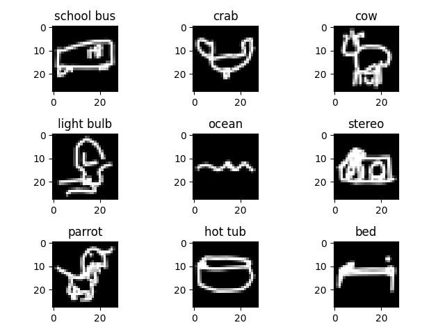
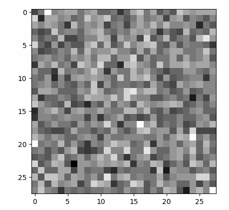
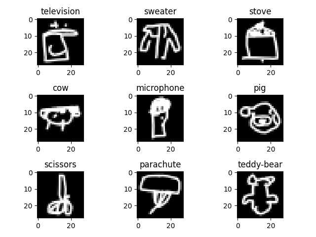

<p align="center">
    
    
    
</p>


# Text-to-Image Diffusion Model using Quick, Draw! Dataset

## Overview

This repository implements a **Text-to-Image Diffusion Model** trained on rasterized versions of the [Google Quick, Draw! Dataset](https://quickdraw.withgoogle.com/data). The base diffusion model code is from [Hugging Face: The Annotated Diffusion Model](https://huggingface.co/blog/annotated-diffusion). It was modified in this project to work well on the Quick, Draw! dataset and take text embeddings as conditioning. The text-conditioning works great for exact labels or phrases the model was trained on, but its performance varies for other phrases.
The workflow includes:

1. **Downloading and Processing** : Convert vector sketches in NDJSON format into rasterized images (`.npy` files).

2. **Training** : A diffusion model conditioned on text embeddings derived from phrases.

3. **Inference** : Generate rasterized images conditioned on textual prompts.

4. **Visualization** : Plot and animate the diffusion process.

---

## Key Features

- Processes Quick, Draw! vector images into 28x28 rasterized images.

- Text conditioning using **BERT embeddings** .

- Implements a **U-Net-based diffusion model** for generating images.

- Supports model training, inference, and visualization of generated results.

---

## File Structure

The repository comprises the following key files:

- **`download_and_convert.py`**: Script to download and convert the dataset for training.
- **`helpers.py`**: Contains utility functions to support various operations.
- **`inference.py`**: Script to perform inference using the trained model.
- **`model_text.py`**: Defines the architecture of the text-to-image diffusion model.
- **`plot_data.py`**: Script to visualize data and results.
- **`train_text.py`**: Script to train the model on the dataset.
- **`vector_to_raster_lib.py`**: Library for converting vector images to raster format.
- **`all_categories.json`**: JSON file listing all categories in the dataset.
- **`alternate_embeddings.json`**: JSON file containing alternative text phrases for the dataset

---

## Dependencies

The project requires the following libraries:

- Python 3.8+

- PyTorch

- NumPy

- Transformers (for BERT text embeddings)

- CairoCFFI (for vector-to-raster processing)

- Matplotlib

- TQDM

- Google Cloud SDK (`gsutil` for data download)

- einops

### Install Dependencies

To install all required packages, run:

```bash
pip install -r requirements.txt
```

For `gsutil`, install the [Google Cloud SDK]() .

---

## Setup and Usage

1. **Downloading and Converting Quick, Draw! Data** The script `download_and_convert.py` automates downloading Quick, Draw! NDJSON files and converts them into rasterized images.
   Run:

```bash
python download_and_convert.py
```

- Downloads NDJSON files from Google Cloud Storage.

- Converts vector images to rasterized images (28x28).

- Saves them as `.npy` files under `guessed_quickdraw_data`.

> **Note** : Ensure `gsutil` is configured and authenticated.

---

2. **Training the Diffusion Model**
   To train the text-to-image model:

```bash
python train_text.py
```

Configuration (inside `train_text.py`):

- `data_paths`: Directory containing `.npy` files.

- `alternate_embeddings_path`: JSON file with alternate text phrases.

- Training parameters like `batch_size`, `learning_rate`, `epochs`, and `diffusion_timesteps`.
  The model is saved every 0.5 epochs to the `models/` directory.

---

3. **Inference: Generating Images** To generate images using a pre-trained model (e.g., `final_model.pth`), run:

```bash
python inference.py --model_path final_model.pth
```

### Steps:

1. Ensure the pre-trained model file `final_model.pth` is located in the root directory or update the path accordingly.

2. Update the `inference.py` script with the following configurations:

- **`model_path`** : Set it to `final_model.pth` (or its correct path).

```python
model_path = "final_model.pth"
```

- **Text Prompts** : Define your phrases under `phrases`:

```python
phrases = ["submarine", "plane", "car"]
```

- Set `random_sample = False` to use specific phrases instead of random categories.

- **GIF Path** : Define where the diffusion process GIF will be saved:

```python
gif_save_path = "results/final_diffusion_process.gif"
```

3. Run the script:

```bash
python inference.py
```
---

## Acknowledgments

- **Google Quick, Draw! Dataset** for vector sketches.
- **[Hugging Face: The Annotated Diffusion Model](https://huggingface.co/blog/annotated-diffusion)** base code for regular diffusion model.
- **Diffusion Models** based on concepts from the paper _"Denoising Diffusion Probabilistic Models"_.
- **BERT** embeddings for text conditioning.
